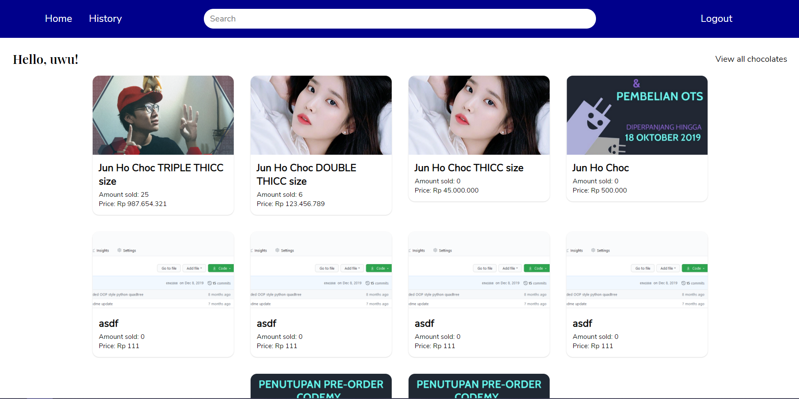
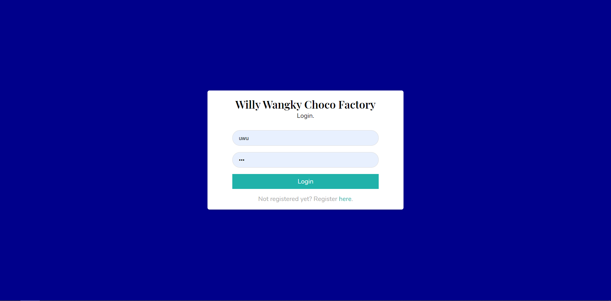
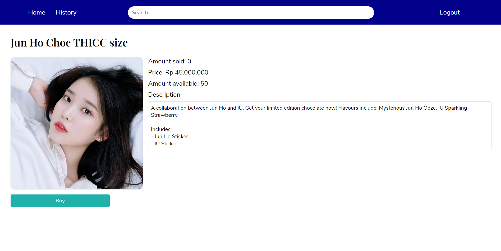

# Tugas 1 IF3110 Pengembangan Aplikasi Berbasis Web

## Deskripsi Aplikasi Web

Aplikasi Web ini adalah aplikasi penjualan coklat sederhana yang memperbolehkan pengguna untuk membeli coklat dan admin untuk menambahkan stok coklat dan membuat coklat baru. Aplikasi dibuat menggunakan Javascript, HTML, CSS, PHP, dan MySQL.

## Daftar requirement

Berikut requirement dari aplikasi web yang dibuat
* Pengguna dapat melakukan pendaftaran akun.
* Pengguna dapat login dengan akun yang telah didaftarkan.
* Pengguna dapat logout dari akun yang telah login.
* Pengguna dapat mencari produk.
* Pengguna dapat melihat detail produk.
* Pengguna dapat membeli produk.
* Pengguna dapat melihat riwayat transaksi dari pembelian yang ia lakukan.
* Pekerja dapat menambah jenis coklat baru.
* Pekerja dapat menambah stok dari coklat yang sudah tersedia.
* Desain aplikasi mengikuti low-fidelity design yang disediakan.

## Cara Instalasi

Download dan install xampp dari link [berikut](https://www.apachefriends.org/index.html).

## Cara Menjalankan Server

Pindahkan isi dari repositori ini ke path htdocs dari xampp yang telah diinstall. Sesuaikan database pada file [config.php](./api/config.php) jika dibutuhkan database baru atau biarkan untuk menggunakan database remote yang sudah terisi.

## Screenshot Tampilan Aplikasi

Berikut beberapa screenshot dari aplikasi.

### Dashboard

### Login

### Chocolate Detail

## Pembagian Tugas

### Frontend
1. Login : 13518xxx, 13518xxx
2. Register : 13518xxx
3. (Lanjutkan …)

### Backend
1. Login : 13518xxx, 13518xxx
2. Register : 13518xxx
3. (Lanjutkan…)

### Frontend
1. Search: 13518044
2. Login: 13518035
3. Register: 13518035
4. Dashboard :13518035
5. Detail: 13518035
6. Navbar: 13518035
7. Create Chocolate: 13518035
8. Verifikasi Cookie: 13518018
9. Buy Chocolate: 13518018
10. Add Chocolate Stock: 13518018
11. Transaction History: 13518018
12. Responsive View: 1358035
13. Real-time Stock Update: 13518044

### Backend
1. Login: 13518044
2. Register: 13518044
3. Search: 13518044
4. Get Chocolate: 13518044
5. Get User Data: 13518044
6. Create Choco: 13518035
7. Update Chocolate Stock: 13518035
8. Get Transactions: 13518018
9. Create Transactions: 13518018
10. Access Token: 13518044